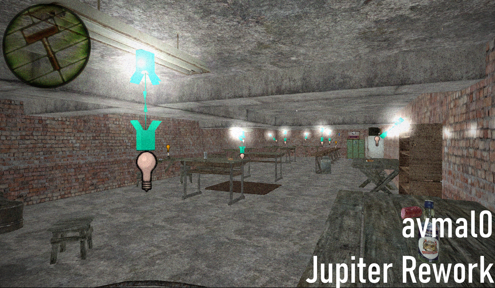

## Вообщем, хотел бы описать немного мыслей по поводу того, что тут

- IDEAS_OR_DOCS 	: хранение всяких идей и документация на механики. Возможно что-то воплотится, а что-то останется "на бумаге"\
- NIGHTLY 			: дневные сборки, могут быть нестабильными (возможно compile будет падать)\
- STABLE 			: стабильная сборка, наиболее стабильна, по сравнению с NIGHTLY сборками.\
- ARCHIVES 			: архивы различных проектов и т.д.\
- GLUA_SCRIPTS 		: директория со всеми скриптами, которые могут выполняться при запуске карты из Workshop'a (будут добавлены в будущие релизы)\
- MATERIALS_TO_MAP 	: думаю добавить материалы, которые используются на карте, именно сюда. Они будут также упаковываться вместе с bsp в архивы.\
- IMAGES 			: изображения, которые могут отражать ход разработки. Могут быть устаревшими.\